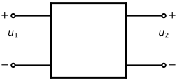
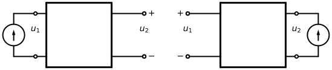

# 4-10  双口网络的电压电流关系

讨论不含独立电源的线性电阻双口网络的 VCR, 并给出两组端口约束.

> 双口 VCR 的一般形式
> 
> $$
\begin{cases}
y _1 = f _1 (x _1, x _2) = k _{1 1} x _1 + k _{1 2} x _2 \\
y _2 = f _2 (x _1, x _2) = k _{2 1} x _1 + k _{2 2} x _2 \\
\end{cases}
$$

> 六种自变量的双口网络
> 
> | 自变量 $x _1$ | 自变量 $x _2$ | 因变量 $y _1$ | 因变量 $y _2$ | VCR       |
> | :---:        | :---:        | :---:        | :---:        | :---:     |
> | $i _1$       | $i _2$       | $u _1$       | $u _2$       | 流控型     |
> | $u _1$       | $u _2$       | $i _1$       | $i _2$       | 压控型     |
> | $i _1$       | $u _2$       | $u _1$       | $i _2$       | 混合 I 型  |
> | $u _1$       | $i _2$       | $i _1$       | $u _2$       | 混合 II 型 |
> | $u _2$       | $- i _2$     | $u _1$       | $i _1$       | 传输 I 型  |
> | $u _1$       | $- i _1$     | $u _2$       | $i _2$       | 传输 II 型 |

## 流控型

自变量为 $i _1$ 和  $i _2$, 因变量为 $u _1$ 和 $u _2$.

$$
\begin{cases}
u _1 = r _{1 1} i _1 + r _{1 2} i _2 \\
u _2 = r _{2 1} i _1 + r _{2 2} i _2 \\
\end{cases}
$$

当 $i _1 = 0$ 时 $r _{1 2}$ 和  $r _{2 2}$ 可确定.

## 压控型

自变量为 $u _1$ 和  $u _2$, 因变量为 $i _1$ 和 $i _2$.

$$
\begin{cases}
i _1 = g _{1 1} u _1 + g _{1 2} u _2 \\
i _2 = g _{2 1} u _1 + g _{2 2} u _2 \\
\end{cases}
$$

当 $u _1 = 0$ 时 $g _{1 2}$ 和  $g _{2 2}$ 可确定.

## 混合型

广泛用于低频晶体管电路的分析.

### I 型

$$
\begin{cases}
u _1 = h _{1 1} i _1 + h _{1 2} u _2 \\
i _2 = h _{2 1} u _1 + h _{2 2} u _2 \\
\end{cases}
$$

### II 型

$$
\begin{cases}
i _1 = h _{1 1} ^{\prime} u _1 + h _{1 2} ^{\prime} u _2 \\
u _2 = h _{2 1} ^{\prime} u _1 + h _{2 2} ^{\prime} u _2 \\
\end{cases}
$$

## 传输型

常用于涉及信号或电力传输问题的分析.

### I 型 | 正向传输型

$$
\begin{cases}
u _1 = A u _2 + B (- i _2) \\
i _1 = C u _2 + D (- i _2) \\
\end{cases}
$$

### II 型 | 反向传输型

$$
\begin{cases}
u _2 = A ^{\prime} u _2 + B ^{\prime} (- i _2) \\
i _2 = C ^{\prime} u _2 + D ^{\prime} (- i _2) \\
\end{cases}
$$

## 六种 VCR 间的转换  各组参数间的关系

对应系数即可.

并不是每一个双口网络都是六种 VCR 俱全的.

> 双口网络策动点电阻的矩阵记法
> 
> $$
\begin{bmatrix}
  u _1 \\
  u _2 \\
\end{bmatrix}
=
\begin{bmatrix}
  r _{1 1} & r _{1 2} \\
  r _{2 1} & r _{2 2} \\
\end{bmatrix}
\begin{bmatrix}
  i _1 \\
  i _2 \\
\end{bmatrix}
$$
> 
> 即 $\mathbf{u} = \mathbf{R} \mathbf{i}$
