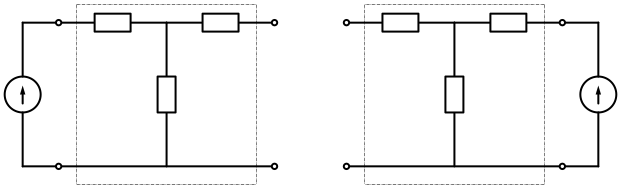
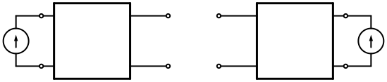

# 4-11  互易双口  对称双口

> **双口的互易性**
> 
> 反向和正向的转移电阻是相等的.
> 
> $$
\frac{u _2}{i _1} {\Large{|} _{i _2 = 0}}
=
\frac{u _1}{i _2} {\Large{|} _{i _1 = 0}}
$$

受控源可以破坏互易性.

> **互易定理**
> 
> > 流控型
> > 
> > $$
r _{1 2} = r _{2 1}
$$
> 
> ---
> > 压控型
> > 
> > $$
g _{2 1} = g _{1 2}
$$
> 
> ---
> 混合 I 型
> > 
> > $$
h _{2 1} = h _{1 2}
$$
> 
> ---
> 混合 II 型
> > 
> > $$
h _{1 2} ^{\prime} = h _{2 1} ^{\prime}
$$
> 
> ---
> 传输 I 型 
> > 
> > $$
\Delta _t = A D - B C = 1
$$
> 
> ---
> 传输 II 型
> > 
> > $$
\Delta _t ^{\prime} = A ^{\prime} D ^{\prime} - B ^{\prime} C ^{\prime} = 1
$$

> **对称双口间的附加关系**
> 
> > 流控型
> > 
> > $$
r _{1 1} = r _{2 2}
$$
> 
> ---
> > 压控型
> > 
> > $$
g _{1 1} = g _{2 2}
$$
> 
> ---
> 混合 I 型
> > 
> > $$
\Delta _h = h _{1 1} h _{2 2} - h _{2 1} h _{1 2} = 1
$$
> 
> ---
> 混合 II 型
> > 
> > $$
\Delta _h ^{\prime} = h _{1 1} ^{\prime} h _{2 2} ^{\prime} - h _{2 1} ^{\prime} h _{1 2} ^{\prime} = 1
$$
> 
> ---
> 传输 I 型 
> > 
> > $$
A = D
$$
> 
> ---
> 传输 II 型
> > 
> > $$
A ^{\prime} = D ^{\prime}
$$
