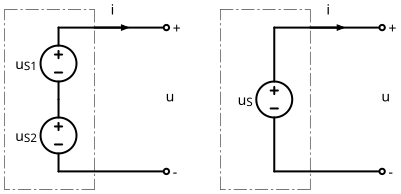
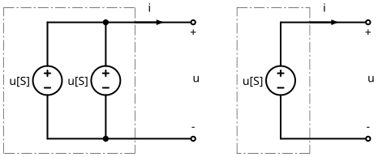
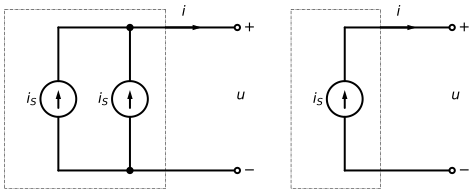
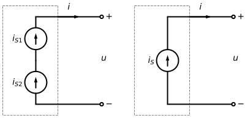
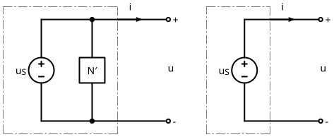
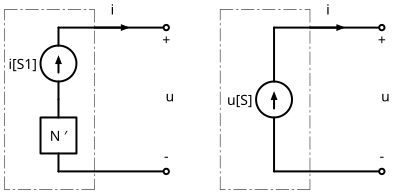
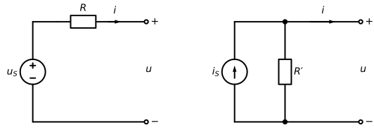

# 4-5  一些简单的等效规律和公式

> **(1) 两电压源串联**
> 
> 
> 
> > 对所有电流 $i$
> >
> > $$u _S: u = u _{S 1} + u _{S 2}$$

---
> **(2) 两电压源并联**
> 
> 
> 
> > 若两电压源并联, 即有
> > 
> > $$u _S: u _{S 1} = u _{S 2}$$
> > 
> > 否则违反 KVL.

---
> **(3) 两电流源的并联**
> 
> 
> 
> > 对所有电压 $u$
> > 
> > $$i _S: i = i _{S 1} + i _{S 2}$$

---
> **(4) 两电流源的串联**
> 
> 
> 
> > 若两电流源串联, 即有
> > 
> > $$i _S: i _{S 1} = i _{S 2}$$
> > 
> > 否则违反 KCL.

---
> **(5) 两电阻的串联**
> 
> > 等效电路
> > 
> > $$R = R _1 + R _2$$

---
> **(6) 两电阻的并联**
> 
> > 等效电路
> > 
> > $$R = \frac{R _1 R _2}{R _1 + R _2}$$

---
> **(7) 电压源与电流源的并联**
> 
> **(8) 电压源与电阻的并联**
> 
> 
> 
> 相当于没有后者.
> 
> $$u = u _S$$

---
> **(9) 电流源与电压源的串联**
> 
> **(10) 电流源与电阻的串联**
> 
> 
>
> 相当于没有后者.
> 
> $$i = i _S$$

---
> **(11) 电压源与电阻的串联**
> 
> **(12) 电流源与电阻的并联**
> 
> 
> 
> 两者可互为等效电路.
> 
> $$R = R ^{\prime}$$
> 
> > 将电流源变为电压源
> >
> > $$u _S = R ^{\prime} i _S$$
> 
> ---
> > 将电压源变为电流源
> > 
> > $$i _S = \frac{u _S}{R ^{\prime}}$$
